## Лаба 1. Разворачивание кластера из 4 машин в облаке с помощью Ambari от Hortonworks

##### [](https://github.com/newprolab/content_bigdata9)

### Дедлайн

⏰ 01.10.2018, 23:59 по Москве

### Задача

Hadoop-кластер удобно разворачивать с помощью бесплатной утилиты Ambari от Hortonworks. Именно это и предстоит вам сделать в этой лабораторной работе, а, скорее, туториале по созданию кластера. Вот увидите — это несложно и очень удобно.

Предварительно надо убедится, что у вас есть:

1. Доступ в [Личный кабинет](http://lk.newprolab.com/)
2. Доступ по ssh на Мастер-сервер. Воспользуйтесь [Инструкцией](../../extra/login_to_master.md)

Мы разбили задачу на 4 части:

1. Получить доступ к виртуальным машинам в ЛК.
2. Установить Ambari на одной из машин.
3. Подключиться через Web-интерфейс к Ambari и собрать из остальных нод кластер.
4. Выполнить простое тестовое задание на кластере.

Когда вы выполните все четыре части задания, зайдите в свой [Личный кабинет](http://lk.newprolab.com/) — там вы сможете проверить правильность выполнения лабораторной работы с помощью автоматического скрипта автопроверки. 

### Часть 1. Получить доступ к виртуальным машинам в ЛК
Зайдите в специальный кабинет для резервирования машин
http://lk.newprolab.com/amazon/ 

Зарезервируйте персональный пул виртуальных машин, нажав на кнопку “Запустить”.

Ваши машины начали инициализацию:
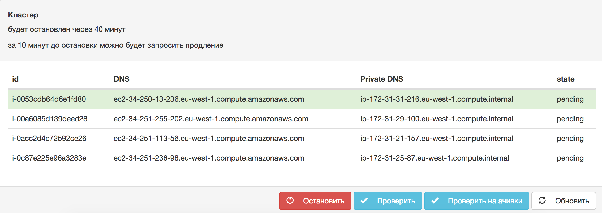

Вы можете увидеть 3 или 4 машины в статусе pending. Подождите немного, потом нажмите кнопку “Обновить”, чтобы получить актуальную информацию о статусе запуска машин. Коннектиться можно, как только написано running. Они выделяются на один час и после этого времени автоматически убиваются. Если часа недостаточно, вы можете продлить время ещё на час.


⚠️ Если машины не появляются в списке, напишите куратору курса или немного подождите: есть вероятность, что слишком много человек одновременно использует инстансы.

Никакой магии не происходит: для вас создаются обычные инстансы на EC2, которые вы можете зарезервировать и самостоятельно, если имеете аккаунт на AWS. 

Допустим, для теста нам выделили следующие машины:

```
ec2-34-250-13-236.eu-west-1.compute.amazonaws.com
ec2-34-251-255-202.eu-west-1.compute.amazonaws.com
ec2-34-251-113-56.eu-west-1.compute.amazonaws.com
ec2-52-16-175-204.eu-west-1.compute.amazonaws.com
```

⚠️ Обратите внимание — эти хостнеймы являются также Public DNS машин. Мы будем работать на первой в списке машине — вам понадобится как её Public DNS (для доступа по SSH/HTTP), так и Private DNS (для настройки взаимодействия внутри кластера).

### Часть 2. Установить Ambari Server на одной из машин

Сначала зайдите на master.cluster-lab.com под своим персональным логином. (См. предварительные требования выше). Скопируйте ваш персональный ключ npl.pem в поддиректорию `.ssh`, и установите подходящие права доступа (в той же инструкции)

Затем зайдём на сервер-менеджер нашего новоиспеченного кластера.

#### Зайти на сервер №1 (сервер-менеджер)

Заходим на первый по списку сервер по SSH:

`ssh -i ~/.ssh/npl.pem ubuntu@<server_manager_public_dns>`

`server_manager_public_dns` — адрес первого по списку сервера, наподобие `ec2-34-250-13-236.eu-west-1.compute.amazonaws.com`. То есть, в нашем примере полная команда будет такой:

`ssh -i ~/.ssh/npl.pem ubuntu@ec2-34-250-13-236.eu-west-1.compute.amazonaws.com`

### Ставим Ambari на сервер-менеджер

⚠️ Все действия, описанные в этой части, предполагают их выполнение от имени пользователя `root`. Поэтому не забудьте им представиться (выполните в консоли команду):

`sudo su`

Добавляем репозиторий Ambari в директорию на установочной машине:

`wget -O /etc/apt/sources.list.d/ambari.list http://public-repo-1.hortonworks.com/ambari/ubuntu16/2.x/updates/2.7.0.0/ambari.list`

`apt-key adv --recv-keys --keyserver keyserver.ubuntu.com B9733A7A07513CAD`

Обновляем apt, чтобы получить доступ к новым пакетам Ambari:

`apt-get update`

Дальше можно проверить, загрузились ли нужные пакеты:

`apt-cache showpkg ambari-server`

`apt-cache showpkg ambari-agent`

`apt-cache showpkg ambari-metrics-assembly`

Правильный вывод любой из команд выше выглядит так:

```bash
Package: ambari-server
Versions: 
2.7.0.0-897 (/var/lib/apt/lists/public-repo-1.hortonworks.com_ambari_ubuntu16_2.x_updates_2.7.0.0_dists_Ambari_main_binary-amd64_Packages)
 Description Language: 
                 File: /var/lib/apt/lists/public-repo-1.hortonworks.com_ambari_ubuntu16_2.x_updates_2.7.0.0_dists_Ambari_main_binary-amd64_Packages
                  MD5: c6d904389bc0d41429b0c7c52796924c


Reverse Depends: 
Dependencies: 
2.7.0.0-897 - openssl (0 (null)) postgresql (2 8.1) python (2 2.6) curl (0 (null)) 
Provides: 
2.7.0.0-897 - 
Reverse Provides: 


```

Теперь мы готовы установить Ambari:

`apt-get install ambari-server`

Пакет весьма увесистый:

`After this operation, 468 MB of additional disk space will be used.`

Через несколько минут установка Ambari будет завершена, и вы увидите следующий вывод в самом конце:

```
Setting up ambari-server (2.7.0.0-897) ...
Processing triggers for libc-bin (2.23-0ubuntu10) ...
Processing triggers for systemd (229-4ubuntu21.4) ...
Processing triggers for ureadahead (0.100.0-19) ...
```

Сервер Ambari установлен, теперь перейдём к его настройке.

### Настройка Ambari

Для настройки Ambari в интерактивном консольном режиме, воспользуемся командой:

`ambari-server setup`
(не забываем, что все команды выполняются из-под пользователя `root`)

На все вопросы установщика отвечаем дефолтно (достаточно нажимать Enter):

`Customize user account for ambari-server daemon [y/n] (n)?`

JDK выбираем версии 1.8.

`Do you accept the Oracle Binary Code License Agreement [y/n] (y)? y`

```
Configuring database...
Enter advanced database configuration [y/n] (n)? n
```

Видим, что установка успешно завершена:

`Ambari Server 'setup' completed successfully.`

Запускаем сервер:

`ambari-server start`

Видим, что всё запустилось: `Ambari Server 'start' completed successfully.` Для тех, кто хочет перепроверить: 

`ps -ef | grep Ambari`

Вывод:

```
root      3718     1 56 11:32 pts/0    00:00:51 /usr/jdk64/jdk1.8.0_77/bin/java -server -XX:NewRatio=3 -XX:+UseConcMarkSweepGC -XX:-UseGCOverheadLimit -XX:CMSInitiatingOccupancyFraction=60 -XX:+CMSClassUnloadingEnabled -Dsun.zip.disableMemoryMapping=true -Xms512m -Xmx2048m -XX:MaxPermSize=128m -Djava.security.auth.login.config=/etc/ambari-server/conf/krb5JAASLogin.conf -Djava.security.krb5.conf=/etc/krb5.conf -Djavax.security.auth.useSubjectCredsOnly=false -cp /etc/ambari-server/conf:/usr/lib/ambari-server/*:/usr/share/java/postgresql-jdbc.jar org.apache.ambari.server.controller.AmbariServer
```

Машина настроена, можно закрыть сессию:

```
exit
exit
```

## Часть 3. Подключиться через Web-интерфейс к Ambari и собрать из остальных нод кластер

Всю дальнейшую работу в этой части будем вести с помощью веб-интерфейса Ambari. 

Заходим браузером по адресу `http://<ambari_server_manager_public_dns>:8080` (вам снова нужен Public DNS той машины, которую вы только что настраивали). Он очень удобно записан в logout-сообщении:

```
logout
Connection to ec2-34-250-13-236.eu-west-1.compute.amazonaws.com closed.
```

В случае наших машин, это http://ec2-34-250-13-236.eu-west-1.compute.amazonaws.com:8080

Логин: `admin`

Пароль: `admin`

Нас интересует кнопка Launch Install Wizard:


Называем наш кластер `newprolab`.

**Select Version**: удалите все репозитории кроме ubuntu16.

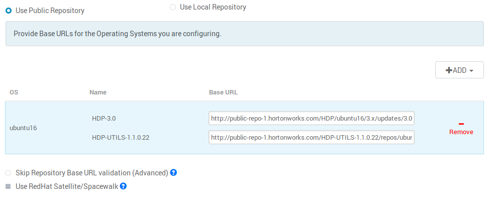


**Install Options**

В Target Hosts указываем *внутренние* DNS-адреса (Private DNS) всех четырёх инстансов. Внутренние адреса оканчиваются на `.internal`. Они вам должны быть видны в ЛК, рядом с Public DNS машин.

В Host Registration Information добавляем свой *private* key `npl.pem`. С помощью этого ключа скрипт деплоя Ambari будет заходить на каждую перечисленную выше вами машину и настраивать все необходимые сервисы.

SSH User Account: ubuntu

SSH Port Number: 22


**Confirm Hosts**

На этом экране проверяется наличие и доступ к указанным вами хостам. Если вы всё сделали правильно, проблем быть не должно, и вы через некоторое время увидите следующий статус (варнинги нам не помешают, продолжаем с ними):

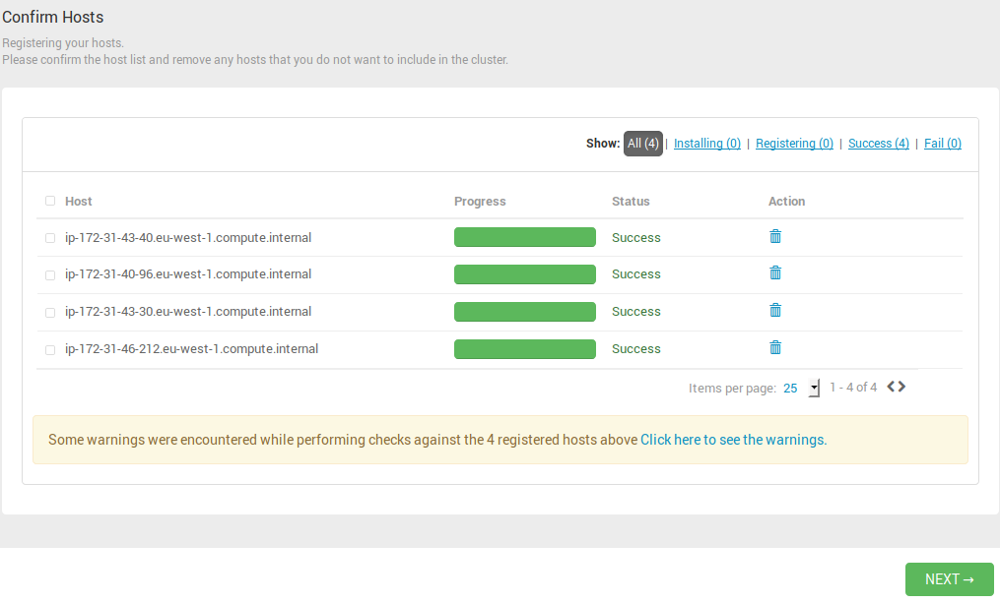

⚠️ Если же вы видите ошибки, вы наверняка:

* Указали Public вместо Private DNS хостнеймы.
* Выбрали какой-то другой ключ.
* Забыли изменить SSH User Account на ubuntu.
* Возможно, что у вас закончился час, и инстансы автоматически удалились.


**Choose Services**

По большому счёту, нам для этой лабораторной работы нужна только самая база:

* HDFS
* YARN + MapReduce2
* ZooKeeper

Все остальные сервисы нам не нужны, выключите их. Разумеется, если вам хочется поэкспериментировать, мы вас не останавливаем :) Можете, например, поставить Ambari Infra и Ambari Metrics, чтобы получить более функциональный мониторинг кластера.

Утверждаем добавление зависимости - Ambari Metrics. Игнорируем Limited Functionality Warning. Нажимаем Proceed Anyway. Дважды!


**Assign Masters**

Нам сейчас не очень принципиальна конфигурация кластера, поэтому оставляем всё в нетронутом виде и нажимаем Next.


**Assign Slaves and Clients**

Убедитесь, что все машины имеют роли DataNode и NodeManager. Остальные настройки можно оставить по умолчанию.

 

**Credentials**

Запоните поля с паролем. В принуципе, это для лабораторной работы не понадобится. Но най всякий случай, запишите. newprolab как пароль подойдет.

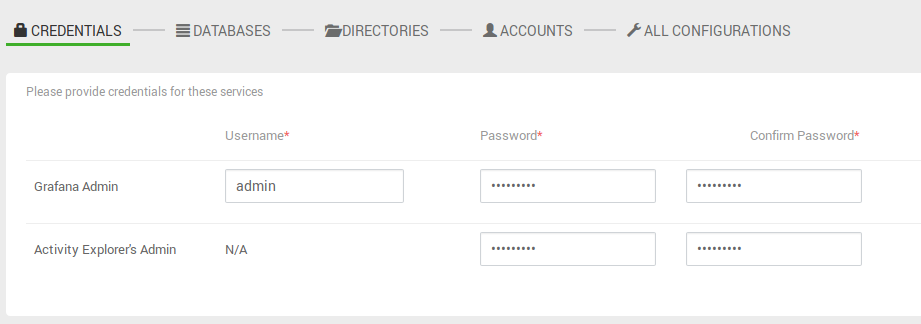

**Directories, accounts**

Оставляем как есть.

**All configurations**

Можно либо ничего не трогать, либо добавить немного Java heap size для NameNode и DataNode, например, до 2GB.


**Review**

Всё должно быть в порядке, так что нажимайте Deploy.

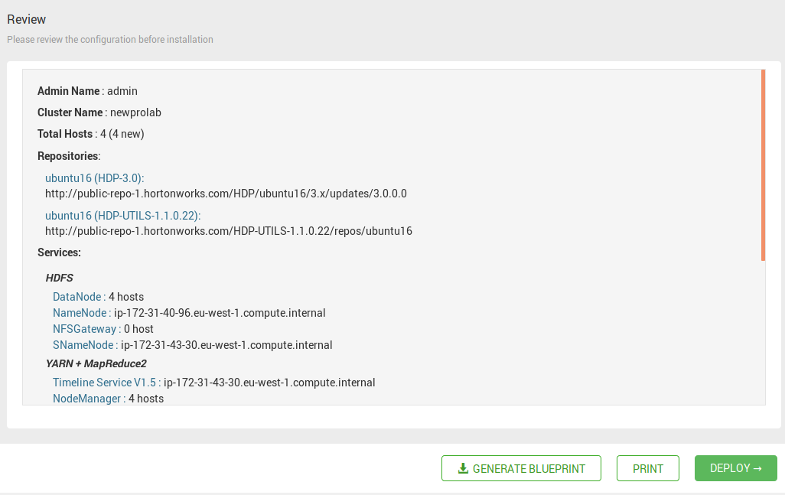

Начинается конфигурирование машин на кластере:

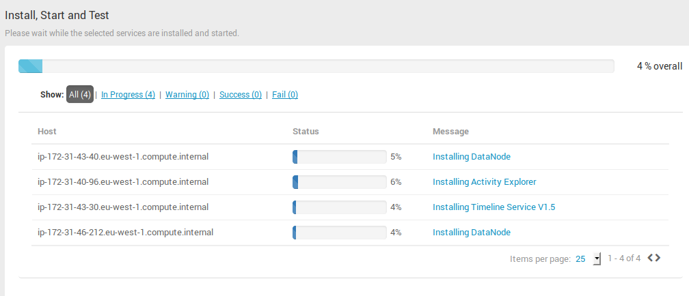 

⚠️ Если вы где-то сильно не ошиблись, процедура должна пройти без ошибок. Главная проблема, которая может теоретически возникнуть — закрытые порты. Когда статус хоста меняется на Fail, открывайте Message для этого хоста и смотрите, что написано в логе. Если это действительно похоже на закрытый порт (обычно это некий отказ в доступе: connection refused), то вам стоит обратиться к куратору. Другая причина — закончилось время жизни инстанса, а вы его не продлили.

После успешного окончания деплоя Message для всех хостов сменяется на Success:

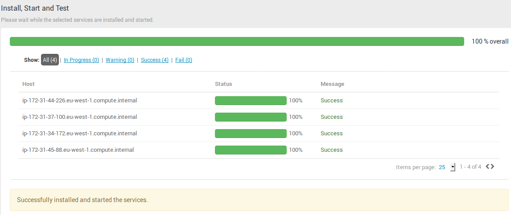 

Однако может заверщиться и с предупреждениями

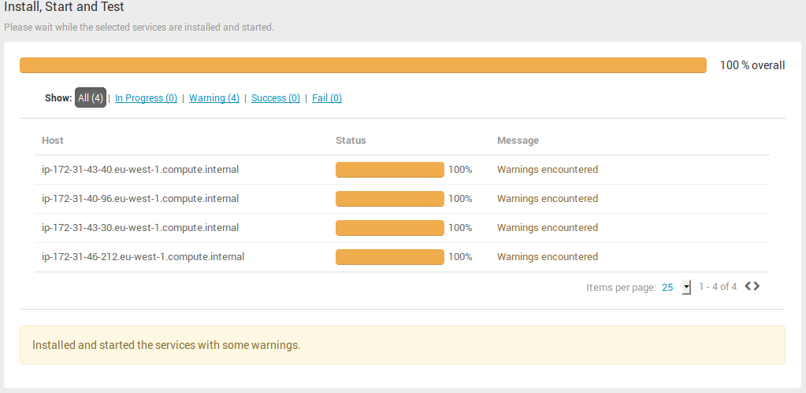 

После этого нажимаем Next, смотрим Summary и завершаем процедуру установки кластера. Если вам стабильно не везёт, то в Summary вы увидите ошибки или варнинги, подробнее о которых будет сказано дальше.

### Веб-интерфейс управления кластером Ambari
Ambari на рабочем и установленном кластере выглядит так:

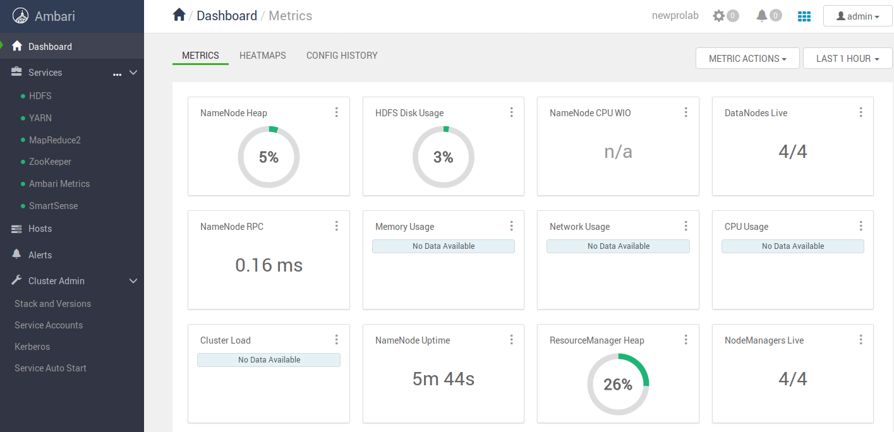 

Если возникают проблемы, вы это сразу же видите по красному цвету:

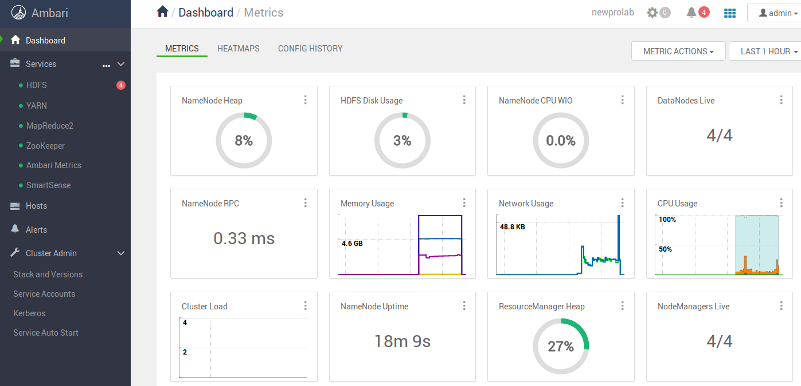 

Для нашего кластера наличие нескольких проблем допустимо, но всё равно их лучше  разобрать — для этого нужно пойти непосредственно в мониторинг хоста, в который проще всего попасть из статус-панели верхнего меню:

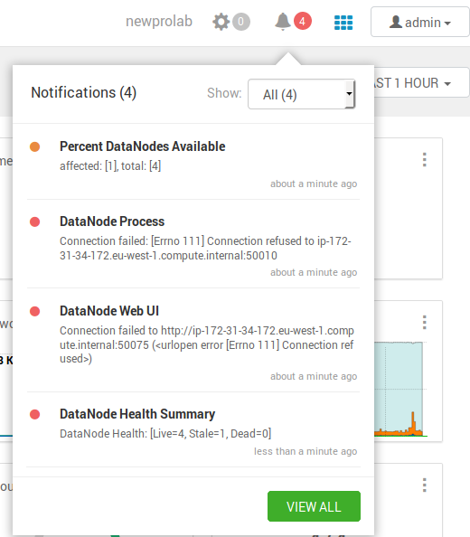 

Или для каждого сервиса отдельно (здесть - для HDFS):

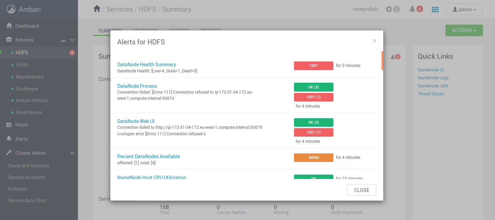 

Смотрим на алерты, в данном случае не запущен сервис data node на одном хосте. Переходим в DATANODES, выбираем хост и используем зеленую Actions чтобы запустить сервис:


В любом случае, смотрите алерты и, если самостоятельно решить проблему не удаётся, обращайтесь за помощью к куратору или коллегам. У нас достаточно тривиальный и протестированный конфиг, поэтому проблема, скорее всего, тоже несложная.

## Часть 4. Выполнить простое тестовое задание на кластере

Снова подключаемся к первой ноде кластера:

`ssh -i npl.pem ubuntu@ec2-34-250-13-236.eu-west-1.compute.amazonaws.com`

Проверяем, создан ли пользователь `hdfs` (через него мы будем работать с HDFS, в том числе, запускать MapReduce jobs):

`sudo cat /etc/passwd | grep hdfs`

Вы должны увидеть вывод: `hdfs:x:1003:1001::/home/hdfs:`. Если же вывод пустой, вам нужно заново выполнить процедуру деплоя кластера: вы там допустили ошибку.

Все дальнейшие действия выполняем под пользователем `hdfs`:

`sudo su hdfs`

Загружаем данные с сервера NPL: 

`wget http://data.cluster-lab.com/public-newprolab-com/numbers.txt.lzma -O /tmp/numbers.txt.lzma`

Распаковываем:

`lzma -d /tmp/numbers.txt.lzma`

Создаём директорию `/users/numbers` на HDFS: 

`hdfs dfs -mkdir -p /users/numbers`

И скидываем в неё наш файл:

`hdfs dfs -put /tmp/numbers.txt /users/numbers/`

Обновляем mapreduce jar-файл, находящийся в HDFS. Для этого сначала проверьте, какая версия HDP у вас стоит:

`hdfs dfs -ls /hdp/apps`

Почти наверняка это `3.0.0.0-1634`, поэтому вы можете скопировать следующие команды:

```
hdfs dfs -rm /hdp/apps/3.0.0.0-1634/mapreduce/mapreduce.tar.gz
hdfs dfs -put /usr/hdp/3.0.0.0-1634/hadoop/mapreduce.tar.gz /hdp/apps/3.0.0.0-1634/mapreduce/mapreduce.tar.gz
```

Если версия отличается, то работать нужно с соответствующей директорией.

Теперь можете запускать MapReduce Job:

`hadoop jar /usr/hdp/3.0.0.0-1634/hadoop-mapreduce/hadoop-streaming.jar -D mapred.reduce.tasks=1 -input /users/numbers -output /users/numbers/result -mapper "cat" -reducer "uniq -c"`

Мы здесь используем простые cli-утилиты `cat` и `uniq`, считаем число уникальных строк — ничего сложного.

Обратите внимание на нижнюю строчку верхней части вывода:

```
hdfs@ip-172-31-43-40:/home/ubuntu$ hadoop jar /usr/hdp/3.0.0.0-1634/hadoop-mapreduce/hadoop-streaming.jar -D mapred.reduce.tasks=1 -input /users/numbers -output /users/numbers/result -mapper "cat" -reducer "uniq -c"
packageJobJar: [] [/usr/hdp/3.0.0.0-1634/hadoop-mapreduce/hadoop-streaming-3.1.0.3.0.0.0-1634.jar] /tmp/streamjob1207629531506590959.jar tmpDir=null
18/09/13 13:45:49 INFO client.RMProxy: Connecting to ResourceManager at ip-172-31-40-96.eu-west-1.compute.internal/172.31.40.96:8050
18/09/13 13:45:49 INFO client.AHSProxy: Connecting to Application History server at ip-172-31-43-30.eu-west-1.compute.internal/172.31.43.30:10200
18/09/13 13:45:49 INFO client.RMProxy: Connecting to ResourceManager at ip-172-31-40-96.eu-west-1.compute.internal/172.31.40.96:8050
18/09/13 13:45:49 INFO client.AHSProxy: Connecting to Application History server at ip-172-31-43-30.eu-west-1.compute.internal/172.31.43.30:10200
18/09/13 13:45:49 INFO mapreduce.JobResourceUploader: Disabling Erasure Coding for path: /user/hdfs/.staging/job_1536845329445_0001
18/09/13 13:45:50 INFO mapred.FileInputFormat: Total input files to process : 1
18/09/13 13:45:50 INFO mapreduce.JobSubmitter: number of splits:2
18/09/13 13:45:50 INFO mapreduce.JobSubmitter: Submitting tokens for job: job_1536845329445_0001
18/09/13 13:45:50 INFO mapreduce.JobSubmitter: Executing with tokens: []
18/09/13 13:45:50 INFO conf.Configuration: found resource resource-types.xml at file:/etc/hadoop/3.0.0.0-1634/0/resource-types.xml
18/09/13 13:45:51 INFO impl.YarnClientImpl: Submitted application application_1536845329445_0001
18/09/13 13:45:51 INFO mapreduce.Job: The url to track the job: http://ip-172-31-40-96.eu-west-1.compute.internal:8088/proxy/application_1536845329445_0001/

```

По этому адресу вы можете посмотреть статус джобы и увидеть логи с ошибками. Одно неудобство — здесь указывается Internal DNS ноды, а подключиться вы можете только к Public DNS. 

Далее вы видите прогресс:
```
18/09/13 13:45:51 INFO mapreduce.Job: Running job: job_1536845329445_0001
18/09/13 13:46:05 INFO mapreduce.Job: Job job_1536845329445_0001 running in uber mode : false
18/09/13 13:46:05 INFO mapreduce.Job:  map 0% reduce 0%
18/09/13 13:46:13 INFO mapreduce.Job:  map 50% reduce 0%
18/09/13 13:46:19 INFO mapreduce.Job:  map 100% reduce 0%
18/09/13 13:46:22 INFO mapreduce.Job:  map 100% reduce 100%

```

После завершения джобы увидите итог:

```
18/09/13 13:46:23 INFO mapreduce.Job: Job job_1536845329445_0001 completed successfully
18/09/13 13:46:23 INFO mapreduce.Job: Counters: 53
...
[[длинный кусок статистики]]
...
18/09/13 13:46:23 INFO streaming.StreamJob: Output directory: /users/numbers/result
```

Смотрим результат: `hdfs dfs -cat /users/numbers/result/* | sort | tail`

В результате должно получиться:

```
70	25523
70	26624
70	394
70	4348
70	6051
70	7310
70	9731
71	38644
71	48445
73	23657
```
Если вы совершили ошибку в последнем задании, то можете стереть данные из HDFS и начать всё сначала при помощи команды:

`$ hdfs dfs -rm -r -f /users/ && hdfs dfs -mkdir -p /users/numbers`

Проверьте правильность выполнения задания на 
http://lk.newprolab.com/amazon/ . После нажатия кнопки "Проверить", не обновляйте вручную страницу: придётся немного подождать.

<p align="center">
  
</p>


