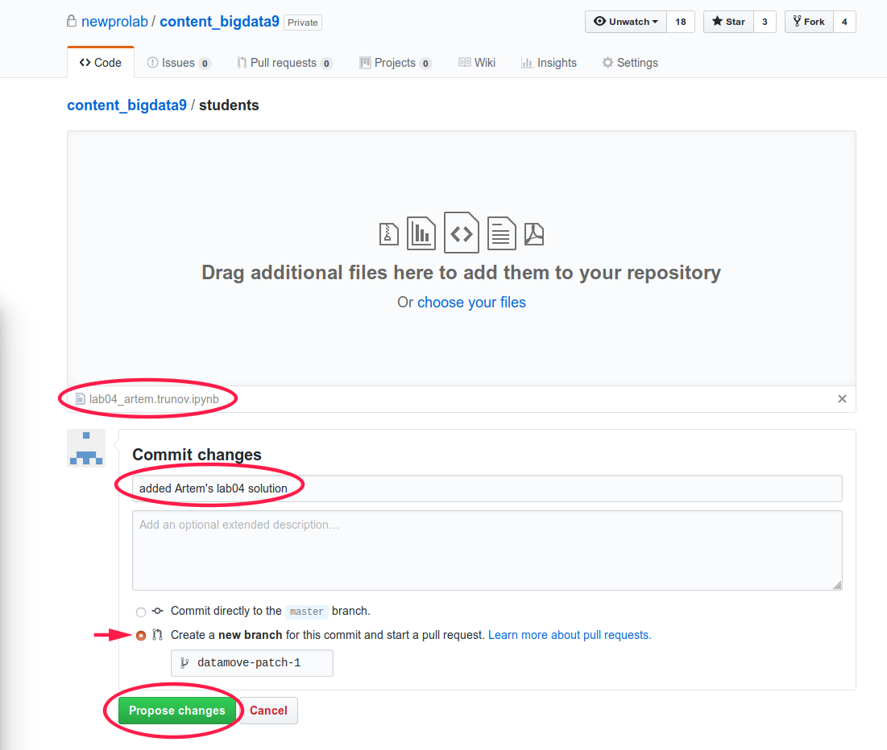
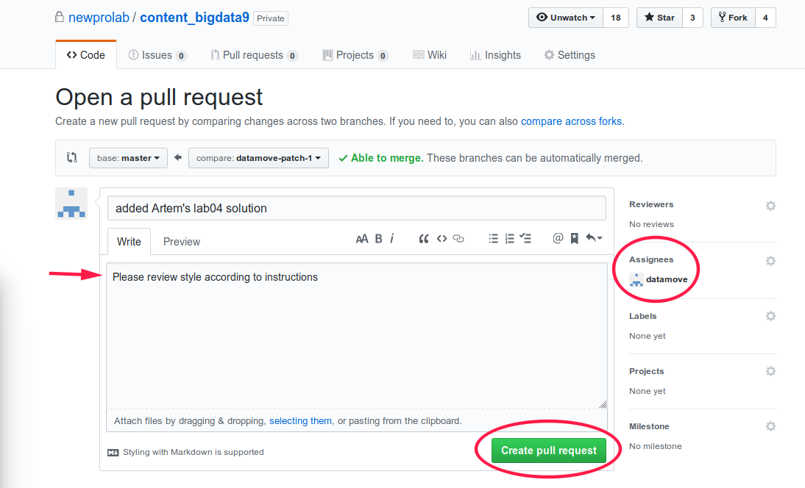

# Как сделать pull-request

## Загрузка файла с пул-реквестом

### Зайдите в папку [students](.) репозитория [content_bigdata9](https://github.com/newprolab/content_bigdata9) на github.com

### Нажмите Upload files 

### Загрузка

1. Выберите ваш файл. Он должен содержать номер лабораторной работы или проекта и ваше имя 
2. Напишите одной строкой содержание коммита
3. Выберите радиокнопку Create a new branch... и оставьте название бранча как есть
4. Нажмите Propose changes

### Pull-Request

На открывшейся странице Open a pull-request:
1. Напишите комментарий об этом пул-реквесте. 
2. Выберите  datamove в качестве Assignee.
3. Нажмите Create pull request

## Review

## Comment

Когда вас назначат ревьюером, вам придет ссылка на пул-реквест:

https://github.com/newprolab/content_bigdata9/pull/1

Вероятно, что выглядеть она будет не так - будет отсутствовать секция Merge pull request, так как принять пул-реквест (merge) может только участник с правами записи в репо.

Просмотрите файл, укаданный в пул-реквесте и напишите ваши комментарии по оформлению проекта и стилю питона.

## Принятие

После принятия пул-реквеста, ваш файл будет доступен в репозитории.

